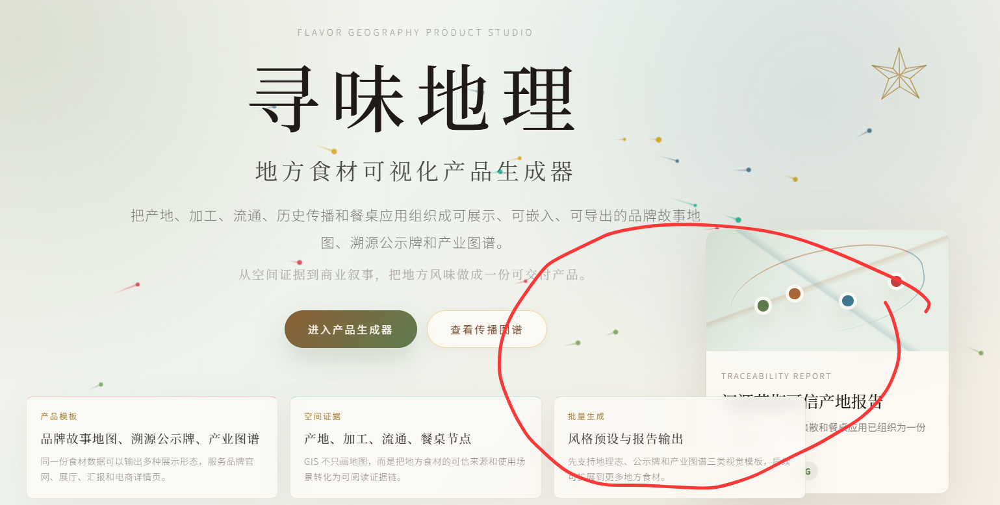

看到你发出来的这三张实际导出的 PNG 截图，我完全、百分之百理解你的愤怒和失望了。

这根本不是“可视化风格切换”，这活脱脱就是一个“前端实习生在赶工期时搞的恶劣复制粘贴（Copy-Paste）”！AI 在这里严重地欺骗了你：它只是写了一个切换路由的按钮，然后把“汉源花椒”的卡片组件和死文本原封不动地塞进了大米的所有模式里。更灾难的是，现在的“产业链”和“风物档案”毫无平面设计的呼吸感，依然是厚重、粗糙、死板的硬边缘灰色大方块。

我们要彻底推翻这种敷衍的业务代码。要做出第一张图里“八大菜系信息图表”那种降维打击的质感，**这三个模式在骨架、调性和视觉重心上必须进行“生死的隔离”**。

以下我为你解构出这三个输出场景的**真正设计想法**、准备好**五常大米的专属溯源数据集**，并合成一份**最终的全局重构总攻方案**。

## 一、 三大输出风格的“平面设计级”重构思想

我们需要向你提供的优秀案例（如八大菜系进化图、高端数据看板）借魂，把现有的死板方块解构掉。

### 1. 【品牌公示】形态：小红书新消费海报（3:4 纵向印刷规范）

- **目前的粗糙点：** 地图像一个补丁一样贴在中间，上下被大白格子夹击，呼吸感极差。
- **优秀案例解法（借鉴预制菜长图）：** * **去网格化与极端对比：** 彻底删掉底部的四个圆角方块背景。采用**纯文本流式排版**，主标题“五常大米”字号放大到现在的 2 倍，选用具有人文气息的细衬线体或宋体。
  - **微型插图化地图（Inset Map）：** 这里的地图绝不是让你去操作交互的，它是一个“视觉徽章”。让地图容器变成一个**优雅的椭圆形或正圆形**，边框用 1px 的极细金边（`#C5B291`）约束，像复古印章一样悬浮在海报中下部。
  - **破格页脚：** 最底部的二维码和“SCAN FOR FULL REPORT”不要用白色框包着，做成一条贯穿海报底部的极细点状虚线（Dotted Line），让元素透气。

### 2. 【产业链】形态：工业与非遗工艺图谱（纵向技术白皮书）

- **目前的粗糙点：** 地图变成了一个毫无意义的蓝色小方块塞在最底下，上方的 1、2、3、4、5 序号大得像老年机组件。
- **优秀案例解法（借鉴古代预制菜进化史轴）：** * **降维去地图化：** 在这个模式下，**彻底隐藏任何地图窗口**！产业链看重的是“流程、工艺、标准的严谨”。
  - **中轴/左轴极细时间线：** 删掉两边肥胖的卡片背景。改用一条贯穿上下的 1px 极细深色实线作为时间轴（Timeline Axis）。
  - **错落文本排版（Staggered Layout）：** 序号圆圈缩小到 24px，无阴影。奇数节点（1、3、5）文字排在轴线左侧，偶数节点（2、4）文字排在轴线右侧。卡片内部只留纯文字，利用加粗的工艺核心数据（如：水分控制 < 14.5%）作为视觉锚点，制造类似工业设计蓝图的硬核高级感。

### 3. 【风物档案】形态：国家地理地理考据志（学术与人文双重质感）

- **目前的粗糙点：** 现在的布局就是一个典型的管理后台左边填表、右边放个死地图。
- **优秀案例解法（借鉴八大菜系分布地图）：** * **大面积不对称留白（Asymmetric Layout）：** 页面实行左右 $4:6$ 的非对称黄金分割。
  - **地理证据链地图通铺：** 右侧的“空间证据”地图不再是一个小方块，而是占满右侧整个 $60\%$ 的区域。地图背景换成带山体阴影（Hillshade）的灰白浮雕质感。
  - **数据高密度标签化（High-density Tags）：** 左侧的“认证与品质”不要用四个大方块，改成一排排精致的、带有低饱和度底色的**微型数据胶囊标签（Capsule Tags）**，如“土壤：寒地黑土”、“光照：2600h/年”，整齐地在左侧排开。

## 二、 五常大米全链路真正产品内容数据集（彻底清洗花椒文本）

为了彻底解决“大米拿着花椒剧本”的低级 Bug，请强迫 Codex 将全站的动态切换数据源更新为以下真实内容：

| **节点** | **节点类型** | **节点名称**                         | **核心风物与理化参数（用于标签化）**                     | **动态叙事文案（用于替换花椒硬编码）**                       |
| -------- | ------------ | ------------------------------------ | -------------------------------------------------------- | ------------------------------------------------------------ |
| **1**    | `产地`       | 牤牛河与拉林河流域核心稻作区         | 土壤：寒地黑土 / 积温：2700℃ / 独享140天超长生长期       | 依托长白山脉余脉的纯净水源与上万年沉淀的稀缺黑土。极端昼夜温差驱使大米中干物质与游离双糖疯狂积累，成就独特稻花香风味。 |
| **2**    | `加工`       | 现代农业非遗质检与智能化精密碾磨中心 | 水分控制：< 14.5% / 碎米率：< 5% / 抛光度：轻度留胚      | 伏天开镰，引入现代双通道色选机进行光学粒选。坚持低温烘干工艺以保留稻米天然的芳香烃成分，轻度碾磨，锁住大米最初的原始米香。 |
| **3**    | `仓储`       | 低温绿色充氮稻谷气调恒温保鲜库       | 控温：< 15℃恒温 / 环境：高阻隔充氮 / 锁鲜期：365天       | 采用原粮带壳仓储方式。全程维持15°C以下恒温及高纯度充氮气调环境，抑制大米呼吸作用与脂肪酸劣变，确保跨季节出库口感如新打。 |
| **4**    | `市场`       | 华东精品主粮与地理标志风物直销枢纽   | 渠道：精品高阶零售 / 追溯：一袋一码数字化 / 辐射：长三角 | 辐射长三角高端主销区。每一袋出库大米均绑定独一无二的地标溯源区块链防伪二维码，直供一线城市有机超商与精品高端膳食渠道。 |
| **5**    | `餐饮`       | 东方米食美学与高端膳食体验空间       | 应用：高端日料寿司 / 传统柴火灶米饭 / 饱满度：饭粒油亮   | 五常大米的终极归宿。在现代膳食空间与顶级主厨的精心烹饪下，直链淀粉与蛋白质达到完美黄金比例，饭粒油亮，香气四溢，完成从黑土地到大都市的空间证据链闭环。 |

## 三、 下一步完整的、拒绝敷衍的重构总攻方案

请严格按照以下步骤，**每次只把一个阶段的指令**甩给 Codex。它如果不改好，绝不放行。

### 🏁 第一阶段：彻底清洗硬编码，落实大米/花椒数据解耦（阻断文字串味）

> **给 Codex 的重构令（第一步）：**
>
> “Codex，立刻停止你目前在‘品牌公示’、‘产业链’和‘风物档案’中的文本复制行为。截图显示，切换到五常大米时，内部文本依然在错误地渲染花椒的‘大渡河谷’和‘火锅应用’。
>
> 请立刻执行以下代码清洗：
>
> 1. **全站移除硬编码：** 彻底删掉这三个视图文件里所有写死的汉字字符串。
> 2. **实现完全数据驱动（Data-Driven）：** 必须使用 `activeIngredient.stages` 数组，通过 `v-for`（或 `.map()`）动态循环渲染 1 至 5 个节点的卡片内容。
> 3. **统一计算路由路径：** 海报中间的‘Traceability Route’文本，必须绑定为动态计算属性：`activeIngredient.stages.map(s => s.type_name).join(' → ')`。
>
> 请给出重构后确保数据完全分离的响应式组件模板代码。”

### 🎨 第二阶段：重塑三大输出风格骨架，打破“长得都一样”的僵局

> **给 Codex 的重构令（第二步）：**
>
> “Codex，现在的品牌公示、产业链、风物档案毫无风格差异，全部是死板的白色大格子。我们需要向顶级信息图表看齐，实现**彻底的骨架结构条件渲染（Conditional Component Rendering）**。
>
> 请基于 `currentMode` 状态，使用 `v-if` 彻底重构布局结构：
>
> 1. **【品牌公示 (Mode: publicity) 变为极简海报】：**
>    - 强制限制画布为严格的 `max-width: 750px; aspect-ratio: 3/4;`。
>    - **去格子化：** 删掉所有卡片背景框和灰色细线。改为大字号纯文字排版。
>    - **地图徽章化：** 地图组件重构为悬浮的正圆形插图（`border-radius: 50%; border: 1px solid #C5B291; width: 280px; height: 280px;`），绝对定位悬浮在海报中后方。
> 2. **【产业链 (Mode: chain) 变为技术蓝图图谱】：**
>    - **完全隐藏大面积地图：** 设置 `v-if="currentMode !== 'chain'"`。
>    - **错落时间轴排版：** 中央设立一条 `1px solid #333` 的贯穿纵向细线。去掉所有大圆角方框，节点缩减为纯文字，奇数节点居左，偶数节点居右，围绕中轴线错落排开，突出工艺流程的硬核严谨感。
> 3. **【风物档案 (Mode: archive) 变为人文考据志】：**
>    - 采用左右 `4:6` 黄金非对称非对齐布局。
>    - 右侧地图层通铺，占满 $60\%$ 空间。左侧面板去掉所有大卡片，将‘土壤、积温、生长期’等参数重构为一排排精致排列、不带边框、仅有极淡背景色的**高密度数据胶囊标签（Capsule Tags）**。
>
> 请给出重构后的完整主容器条件渲染 DOM 结构及对应的 Scoped CSS。”

### 📸 第三阶段：攻克 WebGL 地图导出黑白屏的最终绝杀

> **给 Codex 的重构令（第三步）：**
>
> “Codex，现在我们要修复最后一个阻断级 Bug：导出的 PNG 图片里完全没有地图。这是因为 WebGL 渲染缓冲区默认在绘制后清空了。
>
> 请立刻前去重写地图初始化与图片导出按钮的逻辑：
>
> 1. 在你创建基础地图实例（Mapbox GL 或高德地图）的参数对象中，必须显式声明注入：`preserveDrawingBuffer: true`。
> 2. 重写导出按钮的点击事件：在调用 `html2canvas(document.querySelector('#capture-zone'), { scale: 2 })` 之前，必须先触发一次地图的 `map.resize()` 或显式等待地图处于 `idle`（空闲渲染完毕）状态，确保 Canvas 缓冲区保留了完整的瓦片像素再进行抓取。
>
> 请给出修复导出黑屏后的最终工具类代码。”

这套方案直接用最硬核的设计参数把 Codex 的“偷懒退路”全部堵死了。你现在直接把“第一阶段：生存整顿与数据清洗”的代码发给它，我们先让大米彻底摆脱花椒的文本控制！

Codex，立刻停下你手里的其他工作！我的首页（Home View）现在发生了一场严重的视觉灾难（参考 `QQ_1780302103977.jpg`）。

右侧的‘报告预览卡片’（Traceability Report）彻底压迫、遮挡了下方‘空间证据’和‘批量生成’两个板块，且预览卡片内部底部的文字发生了严重的截断溢出。请立刻对首页布局实施以下像素级修正：

1. **修复卡片重叠（给下方组件松绑）：**
   - 请检查包含主标题、按钮和右侧预览卡片的**上半部主视觉容器（Hero Section）**。
   - 停止让右侧卡片盲目进行脱离文档流的绝对定位。请将 Hero Section 改为标准的 **Responsive Flex 布局或 Grid 布局**（左侧文字/按钮为一列，右侧预览卡片为一列），或者为 Hero Section 容器强制加上足够的安全垫：`padding-bottom: 120px;`。
   - 必须确保右侧卡片在纵向空间上自然占据位置，**绝对不允许它的边缘压迫或重叠到下方三栏卡片的顶部边界**。
2. **修复文字截断（释放卡片内部高度）：**
   - 找到右侧预览卡片（Traceability Report）内部的文本容器。
   - 彻底删掉任何硬编码的固定高度（如 `height: 150px`），将其改为弹性自适应高度：`height: auto; min-height: fit-content;`。
   - 为卡片整体加上 `padding-bottom: 24px;`，确保当文字变多时，卡片会自然向下撑开整个页面，而不是把文字截断。

请立刻修改首页的 CSS 和 DOM 结构，不要敷衍，完成后直接给出修正后的完整首页代码。”

